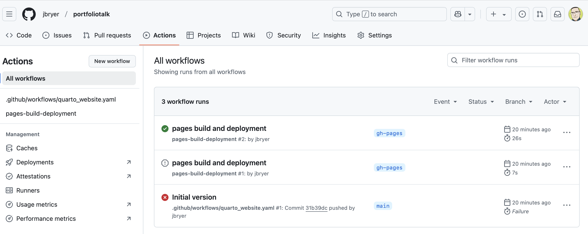

## Motivation

* Syllabi often contain sections that are required of all syllabi and the exact language is out of the control of instructor/course designer.

* Making changes to common portions of syllabi can be challenging administratively.

* Syllabi are often *living documents* and being able to track changes is important.

* Spreadsheets are often a more convienent format for managing schedules and other tabular sections.


See [https://github.com/CUNY-MSDS/Syllabi](https://github.com/CUNY-MSDS/Syllabi)

## Proposed Solution

### Quarto

[Quarto](https://quarto.org) is an extension of [Markdown](https://daringfireball.net/projects/markdown/syntax) which is a document format that utilizes plain text documents. Although originally designed for websites, it is widely used to create other outputs including PDF, Word, and slides.

Quarto, in particular, allows for dynamic code to be embedded. As we will see, we can use this to include common syllabi sections and format schedules that are maintined in spreadsheets.

### Github

[Github](https://github.com) is a popular version control system. Although designed for managing software code, it works well for any plain text documents.

[Github Actions](https://github.com/features/actions) allows for the execution of code. We will see how we can use actions to automatically build PDF documents whenver a syllabus is changed.

[Github Pages](https://pages.github.com) allows for the hosting of static webpages. This specific feature is beyond the scope of this talk, but here is a link to a recording of a talk about building a website portfolio using this approach: [https://bryer.org/posts/2025-02-19-Github_Portfolio.html](https://bryer.org/posts/2025-02-19-Github_Portfolio.html)


## Markdown

A common feature of most of the static website frameworks is that the site content is moslty written in [Markdown](https://daringfireball.net/projects/markdown/syntax). Markdown, originally created by [John Gruber](https://en.wikipedia.org/wiki/John_Gruber), is a lightweight markup language for creating formatted text using a plain-text editor. The idea is to write with minimal *markup* and let the website/document creator handle the specific styling. 

```{r, echo=FALSE, fig.align='center'}
knitr::include_graphics('images/quicktourexample.png')
```

Here are some additional resources for learning markdown:

* [Markdown Guide](https://www.markdownguide.org)
* [R Markdown quick tour](https://rmarkdown.rstudio.com/authoring_quick_tour.html)
* [Markdown for revealjs (this slide deck)](https://revealjs.com/markdown/)

## Literate programming

Donald Knuth introduced a programming framework in 1984 called [literate programming](https://en.wikipedia.org/wiki/Literate_programming). The core idea is that a computer program is written in plain language with interspersed (i.e. embedded) code snippets that implement what is described in the plain text. This has been the foundation for researchers conducting reproducible research. For example, data scientists maintain one document that can contains the description of analyses along with the code that performs the analyses. When the document is rendered, all the code is executed and the output (e.g. tables, figures) are embedded within the final document (e.g. PDF, Word, HTML). 

[RMarkdown](https://rmarkdown.rstudio.com) was an extension to allow for the embedding of R code within markdown documents.This was initially implemented in the [knitr](https://github.com/yihui/knitr) and later allowed for embedding of other languages including Python and SQL.

Quarto extends the ideas of RMarkdown but removes the requirement of R for rendering documents. 

Both Quarto and RMarkdown use the following format to embed code that will be executed when the document is rendered:

```{{LANGUAGE, OPTIONS}}
CODE GOES HERE
```

Where `LANGUAGE` is the programming language (e.g. `r`, `python`, `sql`, `bash`, etc.).


## Syllabus Template

[https://github.com/CUNY-MSDS/Syllabi/blob/master/template/syllabus_template.qmd](https://github.com/CUNY-MSDS/Syllabi/blob/master/template/syllabus_template.qmd)

One aspect of Markdown is the *metadata*. This is defined at the top of the document.

```
---
format: pdf
editor_options:
  chunk_output_type: console
editor:
  markdown:
    wrap: 72
params:
  course_number: ""
  course_name: ""
  semester: ""
  credits: "3"
  instructor: ""
  prerequisites: ""
  email: ""
  github: ""
  office_hours: ""
---

```

## Including common components

One of the nice features of Quarto is that we can break up the document (syllabus) into separate files. Here we are including teh accessibility statement into the syllabus. Note that if we need to change this statement, we change it in one place and will then be reflected in every syllabus upon the next build.

```
  { {< include ../common/accessibility.qmd >} }
```


## Github Actions

We can automate the generation and deployment of our website using [Github actions](https://github.com/features/actions). The [file below](https://github.com/jbryer/portfoliotalk/blob/master/.github/workflows/quarto_website.yaml) is located in the `.github/workflows/` directory.

```{r, file='../.github/workflows/build-syllabi.yaml', eval=FALSE, echo=TRUE}
```

## Github Actions

You can check the status of your Github actions here: [https://github.com/jbryer/portfoliotalk/actions](https://github.com/jbryer/portfoliotalk/actions)

```{r, echo=FALSE, fig.align='center'}

```

## Thank you!

<br/><br/><br/>

:::: {.columns}

::: {.column width="60%"}

Links:

* Github repository: [https://github.com/CUNY-MSDS/Syllabi](https://github.com/CUNY-MSDS/Syllabi)
* Slide deck: [https://jbryer.github.io/portfoliotalk/slides/Syllabi_Talk.html](https://jbryer.github.io/portfoliotalk/posts/slides/Syllabi_Talk.html)

<br/>

Additional Resources:

* [Quarto Project Website](https://quarto.org)
* [Gallery of Quarto Projects (including websites)](https://quarto.org/docs/gallery/)

:::

::: {.column width="40%"}

<br/>
```{r, echo=FALSE, fig.align='right'}
qrcode::qr_code('https://github.com/CUNY-MSDS/Syllabi')|> plot(col = c('#FAFAFA', 'black'))
```

:::

::::


